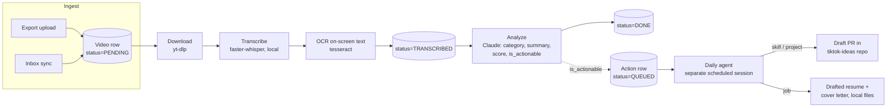
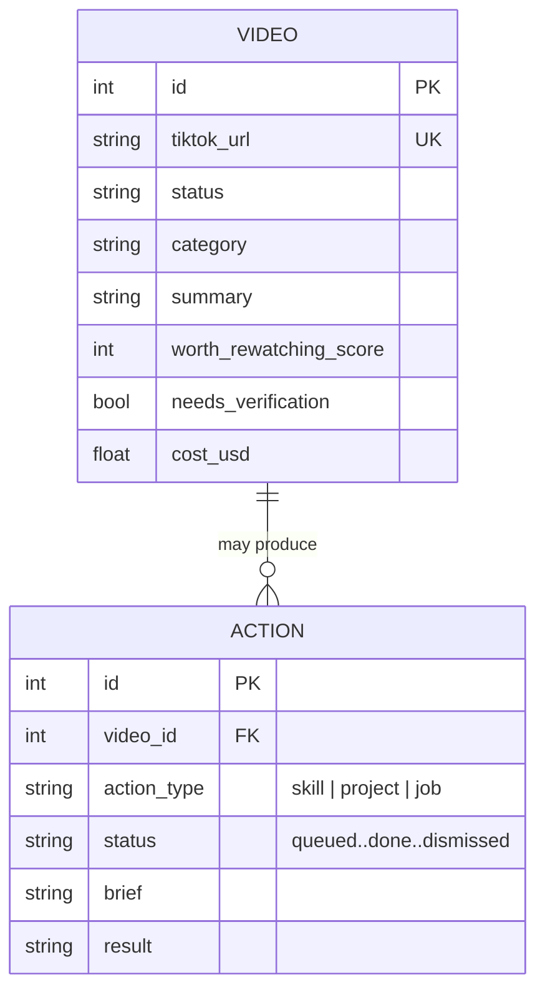
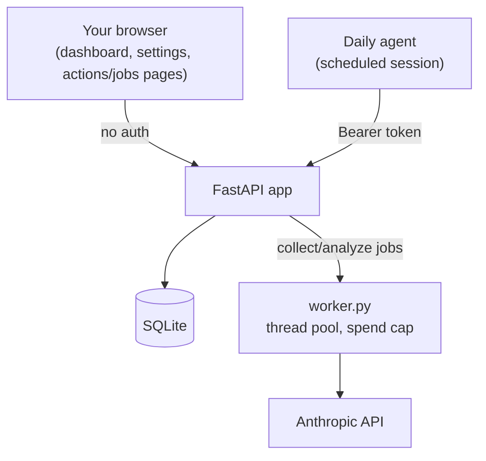

# Architecture

A self-hosted pipeline that turns a TikTok Saved-videos export into a searchable,
categorized library — and, for videos that point at something concrete to do,
a queue of actions (build it, draft a job application) a separate scheduled
agent can act on. This document covers how it fits together and why it's built
this way, not how to run it — see [README.md](README.md) for that.

## Pipeline

Every video goes through the same two-phase pipeline regardless of how it
entered the system (a one-time export upload, or the ongoing inbox sync):
**collect** is free and runs entirely on-device; **analyze** is the one paid
step, and the only one that calls out to Claude.

**Collect** (`app/pipeline.py:collect_video`) and **analyze**
(`app/pipeline.py:analyze_video`) are deliberately separate stages with
separate `Status` values, not one monolithic step — see
[Why two phases, not one](#why-two-phases-not-one-pipeline-step) below.

## Data model

`Action` is a separate table from `Video`, not more columns bolted onto it —
see [key decisions](#key-decisions) below.

## Request flow (dashboard)

Interactive use (you, in a browser) and the daily agent's use (unattended,
over HTTP) are two different trust boundaries hitting the same app:

## Key decisions

Each of these was a real choice with a real trade-off, not a default reached
for without thinking. Noted here mainly so they're easy to re-explain later,
not just to justify them once.

#### Separate `Action` table, not columns on `Video`
`Video` is the already-shipped, stable core table; the action-detection
workflow is new and still likely to change shape. Keeping it in its own
table means schema churn there never touches the table holding the actual
scan history, and gives a natural audit trail (failed/retried attempts are
new rows, not overwritten fields).

#### Batch API for bulk analysis, live calls for small batches
Analyzing thousands of videos one at a time, live, is both slow and the full
price. The [Anthropic Message Batches API](https://docs.anthropic.com) runs
at half price with results typically within hours — worth the latency for a
one-time catch-up of a large backlog, not worth it for "analyze the 10 I just
imported," where you're waiting on the page. `app/worker.py` and
`app/batch.py` expose both; the UI picks a sensible default per context.

#### Bearer-token auth scoped only to the new machine-to-machine routes
The dashboard has no login — it's a single-user, localhost-only app, and
that's a deliberate, documented scope limit (see README). But the routes a
daily *unattended* process calls (`/api/sync/inbox`, `/api/actions/*`) are a
different trust boundary: nothing should be able to trigger them by just
knowing the app is running on the network. Rather than add auth everywhere
(which would break the existing browser-form-driven dashboard), the token
requirement is scoped to exactly the new routes that need it.

#### A dedicated bot TikTok account for the inbox sync, not automating the primary account
The first design automated the user's own logged-in TikTok session directly
to read their Saved page. Real testing showed TikTok's bot detection
escalating in response to that automated traffic — and if it had gone
further, the account put at risk would have been the user's real one. The
current design has a disposable, dedicated account receive videos shared to
it; if that account gets limited or banned, nothing about the user's actual
TikTok presence is affected. Decoupling blast radius from the thing you
actually care about is the general shape of the decision, not just a TikTok
particular.

#### The daily agent is a scheduled session of this harness, not bespoke agent code
Writing code, opening PRs, and drafting tailored documents is exactly what
an agentic coding session already does well. Building a second, bespoke
Anthropic-tool-use loop to replicate that — or shelling out to a separate
headless CLI invocation — would be more code for a worse version of a
capability that already exists. The app's job is narrower: be a reliable,
testable data layer (ingest, collect, analyze, queue) that something with
real tool access can drive.

#### Never fully automate a job application submission
This isn't a configurable setting — it's a hard boundary regardless of how
autonomous the rest of the pipeline is. The agent can draft a tailored
resume and cover letter; submitting it is always a manual action the person
takes themselves. Two independent things enforce this: the daily agent's
own instructions never give it tool access to a live job site in that
branch of work, and (separately, unconditionally) no Claude session —
scheduled or interactive — will autonomously submit a form or enter personal
data into a third-party site on someone's behalf.

#### Why two phases, not one pipeline step
`collect` (download, transcribe, OCR) is free and CPU-bound; `analyze` is
the one step that costs real money per video. Splitting them means a large
backlog can be collected overnight for free, then analyzed later under an
explicit spending cap — rather than every retry of a failed run re-paying
for the parts that already worked. `app/worker.py`'s job modes (`collect`,
`analyze`, `full`) exist specifically to let either run independently.

## Testing

`tests/` covers the pure logic (export parsing, category normalization, the
staleness heuristic), the Claude-calling code with a **mocked Anthropic
client** (no API key or spend needed to test request-building and response
parsing), the idempotent `Action`-queue creation, and the new `/api/*` routes
via FastAPI's `TestClient`. CI (`.github/workflows/ci.yml`) runs `ruff check`
and the full suite on every push, plus a separate job that builds the Docker
image — which would have caught a real bug hit during development (a
`playwright install --with-deps` step that failed on arm64 Debian) before it
ever reached a working machine.
